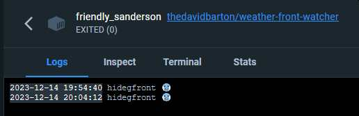

# weather-front-watcher

A weather front watcher app in Docker.

```bash
docker build -t thedavidbarton/weather-front-watcher .
docker run -d thedavidbarton/weather-front-watcher
```



# License

MIT License

Copyright (c) 2023 David Barton
